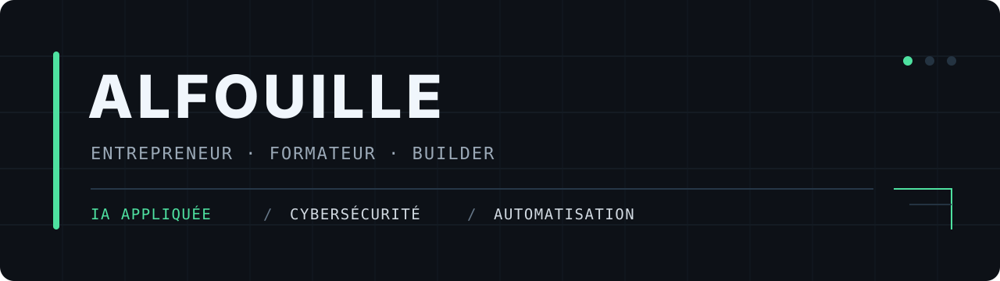

  

## Je construis des outils utiles.

Je m'appelle **Alban**, alias **Alfouille**. Entrepreneur et formateur informatique, je travaille à la croisée de l'**intelligence artificielle**, de la **cybersécurité** et de l'**automatisation**.

Mon fil conducteur est simple : rendre la technologie plus claire, plus accessible et réellement utile. Pas de promesse magique, pas de jargon pour le plaisir — des projets concrets, testés sur le terrain.

### En production

| Projet | Ce que j'y construis |
| --- | --- |
| [**Notit-IA**](https://notit-ia.app/) | Une application francophone pour comprendre l'IA sans se perdre dans le jargon : lexique pédagogique, guides pratiques et comparatifs sourcés. |
| [**OutilsLocaux**](https://outilslocaux.fr/) | Des outils gratuits qui fonctionnent directement dans le navigateur. Pas de compte, pas d'envoi de fichiers, pas de collecte inutile. |
| [**BlackShield Web**](https://web.blackshield-intel.fr/) | Des sites modernes et accessibles pour les artisans, commerçants et indépendants, avec un ancrage local dans le Loiret. |

### Le chantier ouvert

[**BRIQUE**](./brique/) est un journal BuildInPublic local et sans compte, développé une micro-brique utile à la fois.

### Je construis en public

Sur [**X / Twitter**](https://x.com/Alfouille), je documente les coulisses : idées, choix techniques, coûts, erreurs, trafic, monétisation et changements de cap.

Je montre le chantier, pas uniquement la façade.

### Je transmets aussi

Mon rôle de **formateur** nourrit directement ma manière de construire : expliquer sans infantiliser, partir d'un besoin réel et rendre les personnes autonomes. La pédagogie n'est pas une couche ajoutée à mes projets — elle en fait partie dès le départ.

### Mes terrains de jeu

`IA appliquée` · `Automatisation` · `Cybersécurité` · `OSINT` · `Python` · `FastAPI` · `PowerShell` · `Docker` · `Linux` · `n8n`

---

> Le temps et l'énergie sont précieux. La technologie doit nous aider à mieux les utiliser.

  <a href="https://alfouille.blackshield-intel.fr/"><strong>Mon univers</strong></a>
  &nbsp;·&nbsp;
  <a href="https://x.com/Alfouille"><strong>Suivre le BuildInPublic</strong></a>
    
  Toujours là 🦀💪🏻

